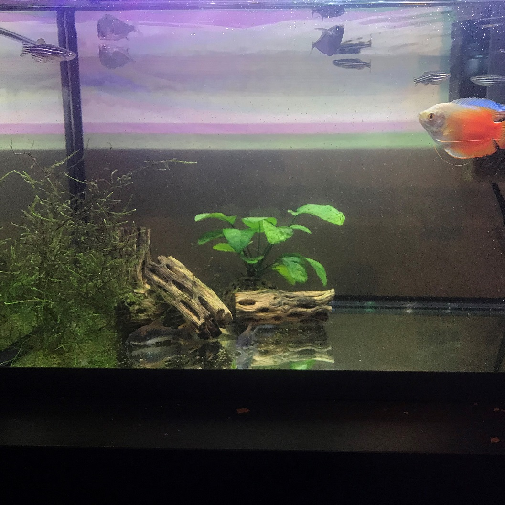

  

At the beginning of this year I decided that I wanted to give it a go at creating an aquarium. Throughout my research I learned many important aspects of creating and maintaining an aquarium. However, the most important aspect that I took from all my research that almost every resource stressed was the nitrogen cycle. As explained by Thomas Reich, "the Nitrogen Cycle is a biological process that involves the continual circulation of nitrogenous compounds such as ammonia, nitrite, and nitrate to process wastes in the natural water." Basically, the fish produce waste, and to process this waste there are specialized bacteria in the water that use it as a food source. If your aquarium is properly maintained your ammonia and nitrite levels should be near zero and your nitrate levels should be less than 10 ppm. Most fish are very hardy creatures and can usually survive in conditions higher than noted, although prolonged exposure to these higher conditions greatly increases the risk of illness and death.

The fish that I received were 5 zebra danios, 3 hatchetfish, 2 cory catfish, and a dwarf flame gourami. I also added in a few ghost shrimp that spend most of their time hidden. I was also really fascinated by and decided to raise a salamander larvae. The main difference between raising a salamander larvae and fish was that salamander larvae are very delicate and need a water temperature range of about 60 degrees Fahrenheit. In Hawaii where the average temperature is a stable 80 degrees Fahrenheit year round this posed a huge problem. By a stroke of luck one of my family members had a water chiller from a previous work project that wasn't currently being used so I was able to borrow it until my salamander morphed into his land-based form.

  
  

