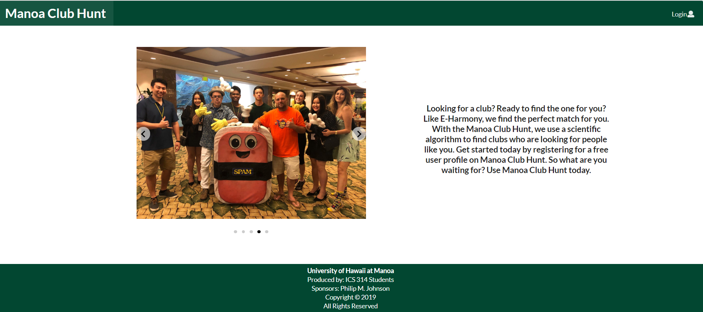
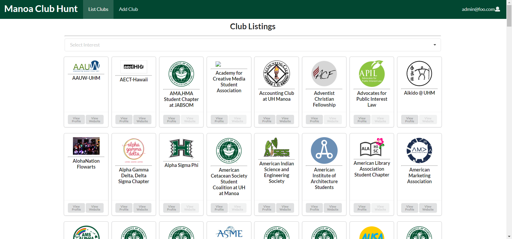

  

## What is Manoa Club Hunt?
UH Manoa has over 200 active clubs, both official and nonofficial. However, there is no easy way for a person to find or even browse through this list of clubs. The goal of Manoa Club Hunt is to enable people in the UH Manoa community to search for clubs to join in a simplified manner. The application provides a directory of clubs that a person can filter based on interests. Clicking on a club's profile will display information about the club including a website link, contact email, and club description.

## My Individual Contributions
For the application my main tasks were to implement the club directory page, add club page, and to create the club schema and associated data. A few other notable tasks I worked on for this application were creating the club profile page, fixing a major bug in the edit club form, and organizing the group's tasks.

  

## The Skills I Developed 
Throughout this project I developed many skills in both website application development and working in a group. I gained a greater understanding of Semantic UI React, learning how to integrate multiple features with each other such as using a dropdown as a filter. I also gained a better understanding of how Javascript, HTML, and CSS all work in tandem. Lastly, as our project's organizer I learned how to create and manage our team's tasks through issue driven project management. 

## Links
* [_Github Organization Link_](https://github.com/manoa-club-hunt)
* [_Project Home Page_](https://manoa-club-hunt.github.io/)
