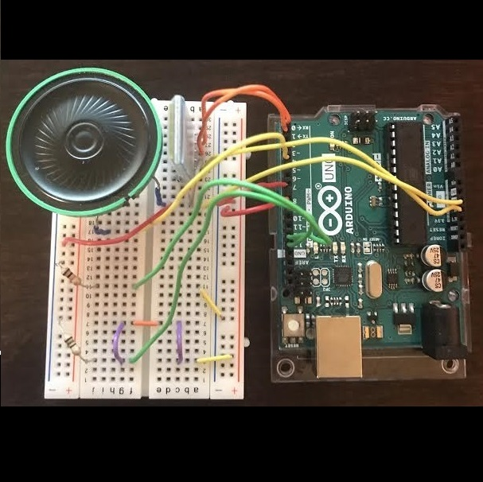
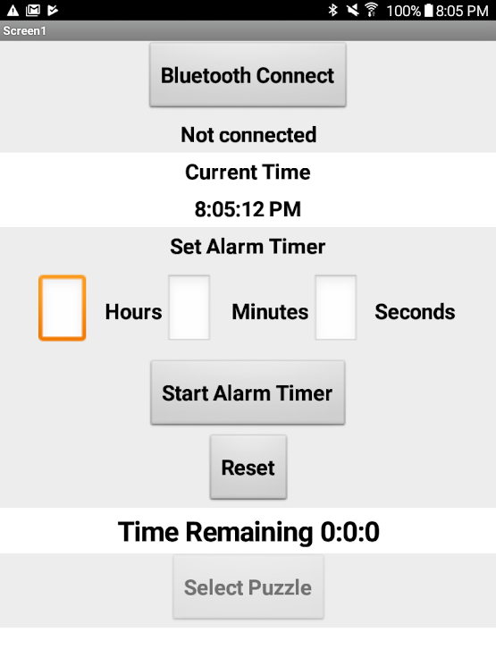

  
  

For this project my partner and I chose to create a puzzle alarm clock using an Arduino Uno and the MIT Appinventor. The puzzle alarm clock functions as any other alarm clock would: you set a timer, it counts down, and an alarm will sound when the timer is complete. For this alarm clock however, we added a new feature where in order to turn off the alarm a circuit puzzle must first be completed on the breadboard. The alarm speaker was implemented using the Arduino Uno and a breadboard, and the alarm timer was implemented with the MIT Appinventor. 

The purpose of our project was to introduce a puzzle feature into an alarm clock that will stimulate a person’s brain so that when they complete the puzzle and turn off the alarm, they will be wide awake and less prone to falling back asleep. We got our inspiration from the fact that the only action required to turn off a regular alarm clock is the press of a button. Now, for a person who might be too tired to think clearly, all they will think about when the alarm sounds is that they want to go back to sleep. This leads to the person just pressing the snooze or off button to turn off the alarm and heading back to sleep, which is very common and has happened to almost everyone at least once.
