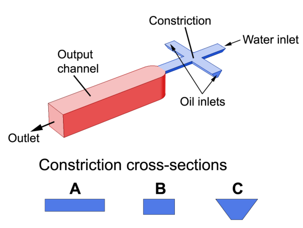

  

This was VIP that I was a part of for my EE 396 requirement. The premise of this project was to create a droplet generator chip that merged a water droplet with a single cell and a water droplet with a PCR barcode. The purpose of having a water droplet with a cell and PCR barcode together is that researchers are able to effectively perform experiments on a single cell, instead of a batch of cells, leading to more accurate results. For our particular group, our goal was to create an effective chip design and operating procedures that will give researchers at the John A. Burns School of Medicine (JABSOM) a reliable chip to do experimentation on.

While I can't give any technical details on what I have learned in this project, I did learn many valuable work-related skills. I learned how to more effectively work in a group, how to find published research using UH's databases, and how to properly document your research for the purposes of copyrighting and publishing your work.
